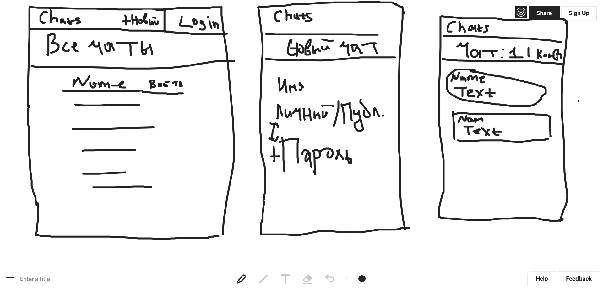
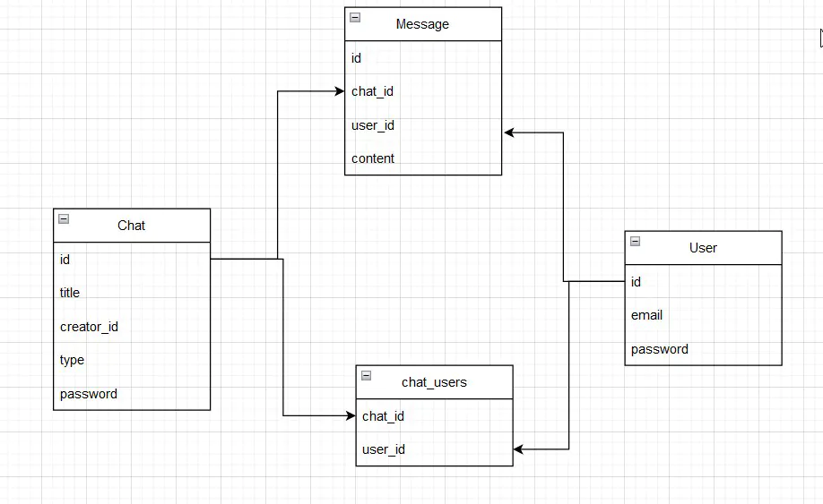
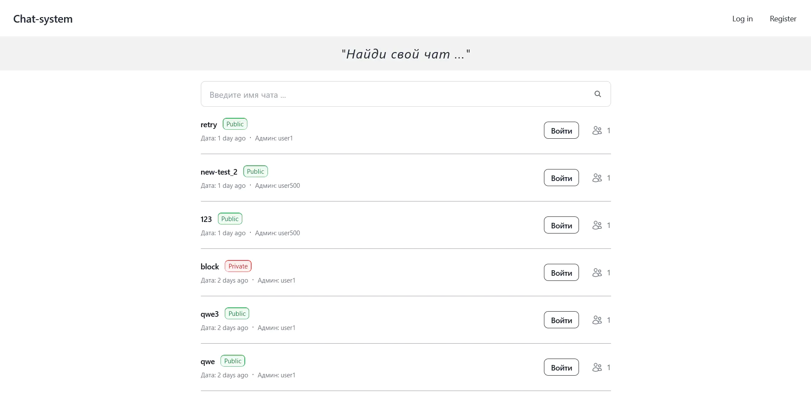
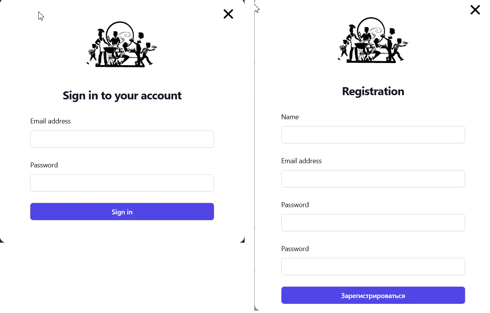
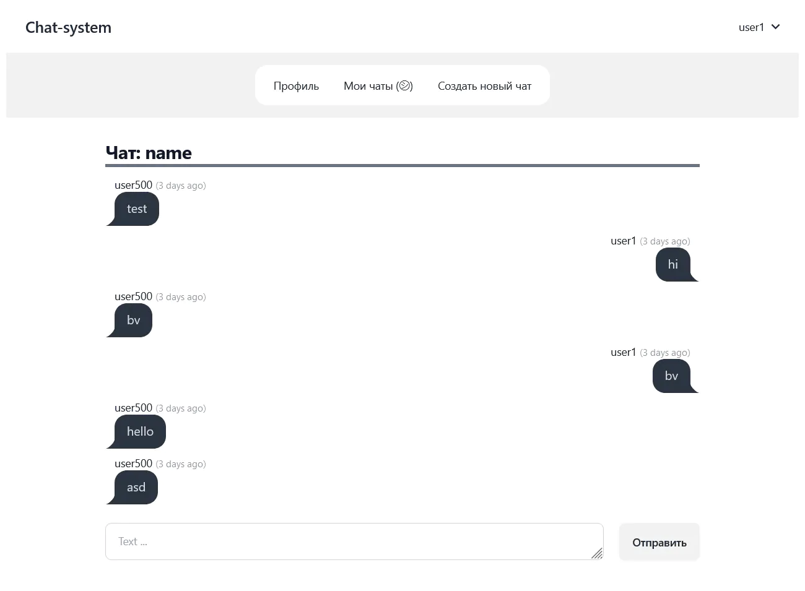

##  Проект: Chat - system 

Чат - система, реализованная с помощью laravel и vue.

Запуск:
1) Склонировать репозиторий `git clone`
2) Скопировать `.env.example` файл как `.env` указать данные БД
3) Run `composer install`
4) Run `php artisan key:generate`
5) Run `php artisan migrate`
6) Run `php artisan serve` для локальной разработки
7) Run `npm run dev`

Функционал (реализован):
1) Своя аутентификация
2) Авторизация доступа к чатам.
3) Создание чатов (публичный / приватный)
4) Настроен доступ к чатам по типу
5) Общение в реальном времени (websockets)
6) Сделан дизайн страниц
7) Модальные окно для аутентификации
8) Чаты, в профиле возвращены по дате присоединения

Функционал (в процессе):
1) Добавление фото в профиль пользователя
2) Пагинация, фильтрация
3) Перекомпоновка компонентов на фронтенде
4) Теги для чатов
5) Значок (в сети/ не в сети)
6) Sidebar со всеми участниками чата (?)

### План проекта

Набросок:
  

  
Схема БД:
  

  

### Реализация

Страница Home:

  
Модальные окна:

  
Dashboard (страница переписки):

